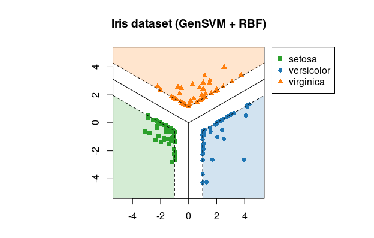

GenSVM R Package
================

This package implements the GenSVM Multiclass Support Vector Machine 
classifier in R.



```r
# Plot created with:
> library(gensvm)
> x <- iris[, -5]
> y <- iris[, 5]
> fit <- gensvm(x, y, kernel='rbf', gamma=10, max.iter=5000, verbose=1, random.seed=123)
> plot(fit, x, y, xlim=c(-5, 5), ylim=c(-5, 5))
> title("Iris dataset (GenSVM + RBF)")
```

Introduction
------------

The GenSVM classifier is a generalized multiclass support vector machine 
(SVM). This classifier aims to find decision boundaries that separate the 
classes with as wide a margin as possible. In GenSVM, the loss functions that 
measures how misclassifications are counted is very flexible. This allows the 
user to tune the classifier to the dataset at hand and potentially obtain 
higher classification accuracy. Moreover, this flexibility means that 
GenSVM has a number of alternative multiclass SVMs as special cases. One of 
the other advantages of GenSVM is that it is trained in the primal space, 
allowing the use of warm starts during optimization. This means that for 
common tasks such as cross validation or repeated model fitting, GenSVM can 
be trained very quickly.

For more information about GenSVM, see the paper: [GenSVM: A Generalized 
Multiclass Support Vector Machine](http://jmlr.org/papers/v17/14-526.html) by 
G.J.J. van den Burg and P.J.F. Groenen (*Journal of Machine Learning 
Research*, 2016).


Installation
------------

This package can be installed from CRAN:

```r
> install.packages('gensvm')
```

Usage
-----

The package is extensively documented with many examples. See 
`?gensvm-package`, `?gensvm` and `?gensvm.grid` in R.

The main GenSVM functions are:
* `gensvm` : Fit a GenSVM model for specific model parameters.
* `gensvm.grid` : Run a cross-validated grid search for GenSVM.

Both these functions return S3 objects that for which `plot` and `predict` 
functions are available. For the GenSVMGrid object the function is applied to 
the best model found during training. For both of these objects a `coef` 
function is also available.

The following utility functions are also included in the package:
* `gensvm.accuracy` : Compute the accuracy score between true and predicted 
  class labels
* `gensvm.maxabs.scale` : Scale each column of the dataset by its maximum 
  absolute value, preserving sparsity and mapping the data to [-1, 1]
* `gensvm.train.test.split` : Split a dataset into a training and testing 
  sample
* `gensvm.refit` : Refit a fitted GenSVM model with slightly different 
  parameters or on a different dataset

Citing
------

If you use GenSVM in your work, please cite the paper using the information 
avialable through the following R command:

```r
> citation('gensvm')
```

Alternatively, you can use the following BibTeX code directly:

    @article{JMLR:v17:14-526,
      author  = {Gerrit J.J. {van den Burg} and Patrick J.F. Groenen},
      title   = {{GenSVM}: A Generalized Multiclass Support Vector Machine},
      journal = {Journal of Machine Learning Research},
      year    = {2016},
      volume  = {17},
      number  = {225},
      pages   = {1-42},
      url     = {http://jmlr.org/papers/v17/14-526.html}
    }

License
-------

    Copyright 2018, G.J.J. van den Burg.

    RGenSVM is free software: you can redistribute it and/or modify
    it under the terms of the GNU General Public License as published by
    the Free Software Foundation, either version 3 of the License, or
    (at your option) any later version.

    RGenSVM is distributed in the hope that it will be useful,
    but WITHOUT ANY WARRANTY; without even the implied warranty of
    MERCHANTABILITY or FITNESS FOR A PARTICULAR PURPOSE. See the
    GNU General Public License for more details.

    You should have received a copy of the GNU General Public License
    along with RGenSVM. If not, see <http://www.gnu.org/licenses/>.

    For more information please contact:

    G.J.J. van den Burg
    email: gertjanvandenburg@gmail.com
